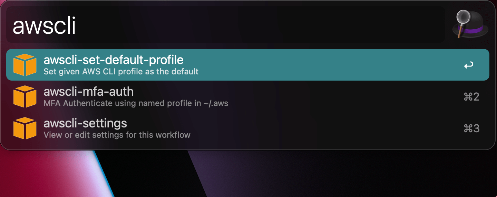
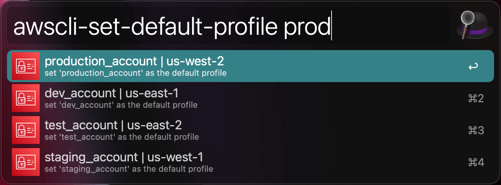
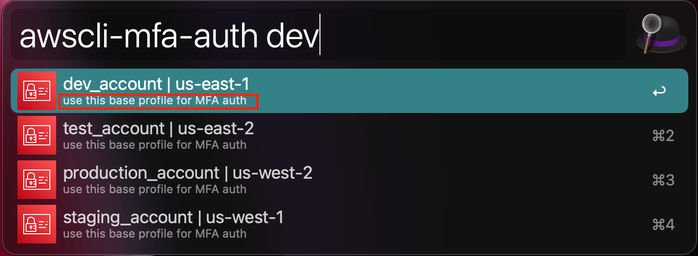
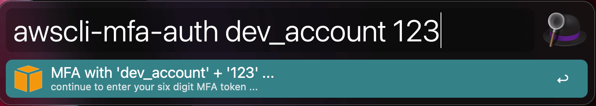

Welcome to ``afwf_awscli_profile`` document
==============================================================================
This project is a `Alfred Workflow <https://www.alfredapp.com/workflows/>`_ that manipulate your AWS CLI profiles.

Features
------------------------------------------------------------------------------
.. contents::
    :depth: 1
    :local:

Search and Set AWS CLI Profile as Default
~~~~~~~~~~~~~~~~~~~~~~~~~~~~~~~~~~~~~~~~~~~~~~~~~~~~~~~~~~~~~~~~~~~~~~~~~~~~~~
Full text search your aws named profiles, set given one as the default (by editing the ~/.aws files). This allows you to switch between different AWS profiles easily.

Search and set AWS CLI profile as default:

MFA Authentication
~~~~~~~~~~~~~~~~~~~~~~~~~~~~~~~~~~~~~~~~~~~~~~~~~~~~~~~~~~~~~~~~~~~~~~~~~~~~~~
Do MFA authentication for a given AWS CLI. For example, suppose that you have a base profile ``my_work``, it will automatically create a ``my_work_mfa`` profile and set it as the default.

Select base profile for MFA

Enter token for MFA

Do MFA Authentication, generate / update the ``${base_profile}_mfa`` profile.

Install
------------------------------------------------------------------------------
- Make sure your MacOS has Python3.7+, if your system Python is <3.7, you can use `pyenv <https://github.com/pyenv/pyenv>`_ to install Python3.8+. You can run this command to check your system Python version ``/usr/bin/python3 --version``.
- Make sure you have installed `Alfred 3+ <https://www.alfredapp.com/>`_.
- Make sure you already purchased `Powerpack <https://www.alfredapp.com/powerpack/>`_, you have to buy powerpack to use `Alfred Workflow <https://www.alfredapp.com/workflows/>`_ feature.
- Go to `Release <https://github.com/MacHu-GWU/afwf_awscli_profile-project/releases>`_, download the latest ``afwf_s3-${version}-macosx_${cpu_platform}.alfredworkflow``. And double click to import to Alfred Workflow.
